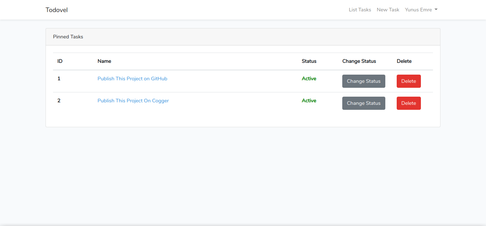

# Todovel
Todovel, a simple todolist app written with Laravel. An application written just to learn Laravel.

# Setup
First, we clone the repo and we rename the **.env.example** file to **.env.example**.

```bash
~$ git clone https://github.com/emregeldegul/todovel.git && cd todovel
~$ mv .env.example .env
```
Then we make the database settings in the **.env** file.

```
DB_CONNECTION=mysql
DB_HOST=127.0.0.1
DB_PORT=3306
DB_DATABASE=cl_todovel
DB_USERNAME=root
DB_PASSWORD=
```
Ok.   Now we can run **composer install** and the **migrations**.

```bash
~$ composer install
~$ php artisan key:generate
~$ php artisan migrate
```
Successful!   He can stand up now!

```bash
~$ php artisan serve
```
Visit http://127.0.0.1:8000


